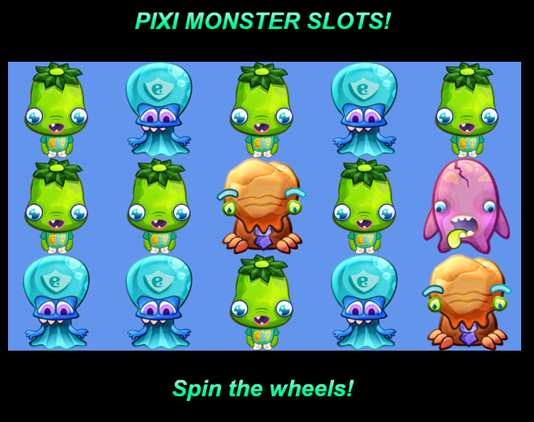

# PixiJS Slot Machine TypeScript Conversion


This project is a TypeScript conversion of the PixiJS Slot Machine example originally provided in JavaScript on the official PixiJS website: [PixiJS Slot Machine Example](https://pixijs.com/examples/advanced/slots).

## Overview

PixiJS is a powerful 2D rendering engine for the web, and this project demonstrates the creation of a slot machine game using PixiJS. The original code has been adapted and converted from JavaScript to TypeScript for enhanced readability and maintainability.

## Original Source

The original JavaScript code was sourced from the PixiJS examples repository, specifically the [PixiJS Slot Machine example](https://pixijs.com/examples/advanced/slots) available on the PixiJS official website.

## Conversion to TypeScript

The code has been converted to TypeScript, providing static typing to improve code quality and development experience. This conversion enhances the project's maintainability and makes it more accessible for developers who prefer or require TypeScript in their projects.

## Getting Started

1. **Clone the Repository:**
   ```bash
   git clone https://github.com/your-username/pixijs-slotmachine-typescript.git
   ```

2. **Install Dependencies:**
   ```bash
   cd pixijs-slotmachine-typescript
   npm install
   ```

3. **Run the Project:**
   ```bash
   npm start
   ```
   Open your browser and navigate to [http://localhost:1234/](http://localhost:1234/) to view the PixiJS Slot Machine in action.

## Project Structure

- **`src/`**: Contains the TypeScript source code and ``index.ejs`` file.
- **`package.json`**: Node.js package configuration with dependencies.

## Dependencies

- [PixiJS](https://pixijs.com/): A fast 2D rendering engine for the web.

## Acknowledgments

Special thanks to PixiJS for providing the original code as part of their examples.
Also big thanks to [https://github.com/miltoncandelero](Mitlon Candelero) for providing the [https://github.com/miltoncandelero/pixi-hotwire](`pixi-hotwire` repository)

